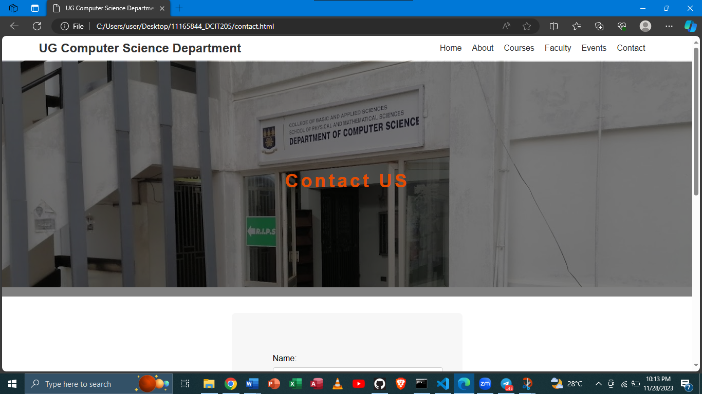
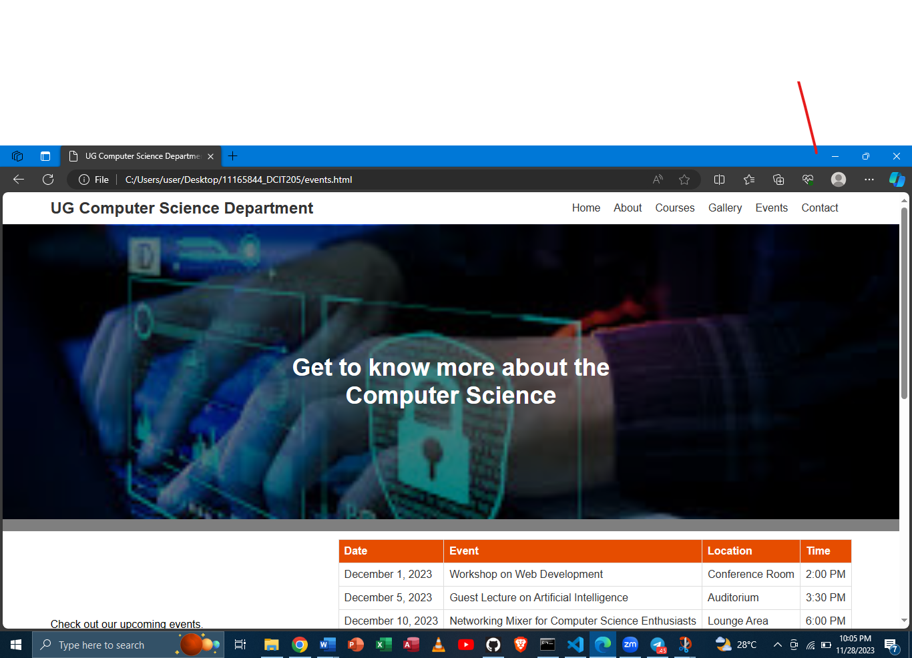
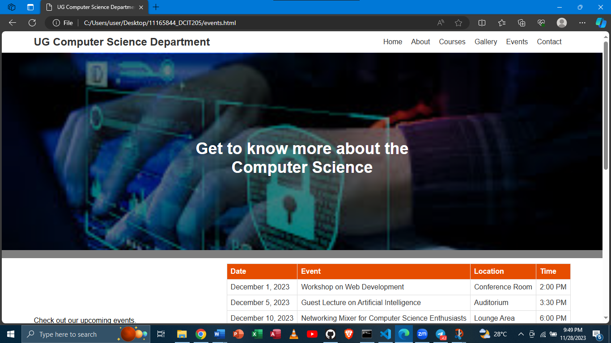
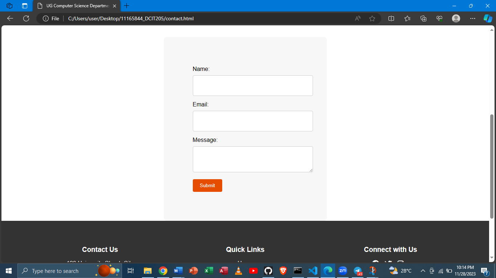
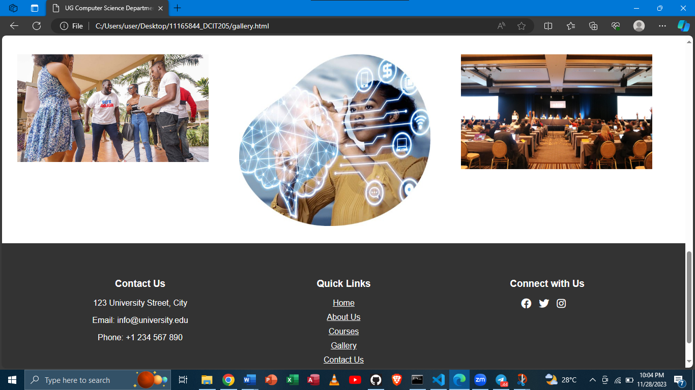
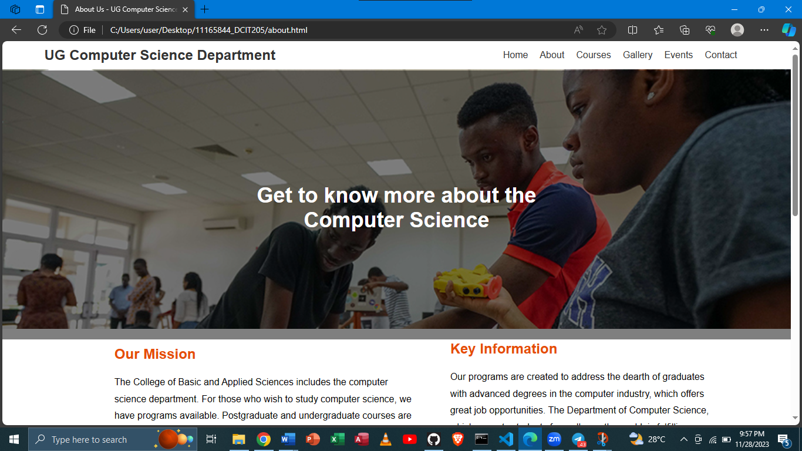
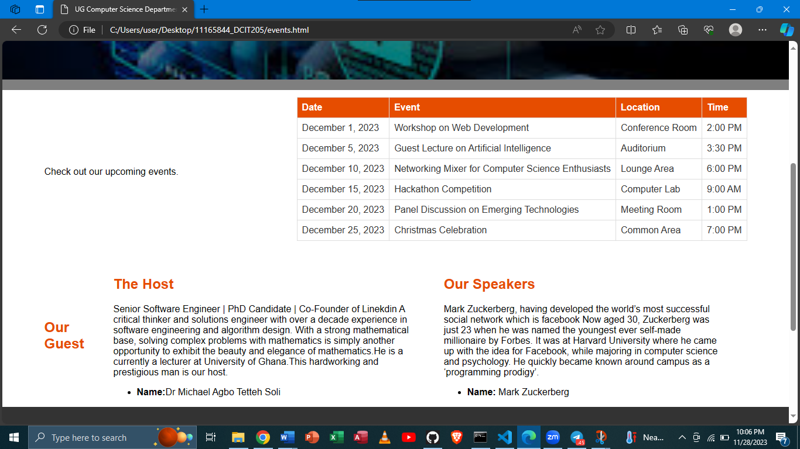

# Department of Computer Science Website

This is the website for the Department of Computer Science at University of Ghana. The website provides information about the department, its faculty and staff, academic programs, research activities, and other relevant information.

## Table of Contents
1. Introduction
2. Features
3. Installation
4. Usage
5. Contributing
6. Things i learnt

## Introduction
The Department of Computer Science Website serves as a central hub for all information related to the department. It aims to provide students, faculty, staff, and visitors with easy access to relevant information and resources.

## Features
- Home: This page comprises of the department’s website which delves into the technological world, its impact, student testimonials, and the exploration of the courses.
- About Us: Learn about the department's mission, vision, and history.
- Faculty and Staff: Browse through profiles and contact information of faculty and staff members.
- Academic Programs: Explore the undergraduate and graduate programs offered by the department.
- Research: Discover the ongoing research projects and areas of expertise within the department.
- Events: Stay updated with departmental events, workshops, and seminars.
- News and Announcements: Read the latest news and announcements related to the department.
- Resources: Access useful resources such as course materials, study guides, and coding examples.
- Contact: Find contact information for general inquiries and specific departments within the department.

## Installation
To run the Department of Computer Science Website locally, follow these steps:
1. Clone the repository: `git clone https://github.com/AmaPrincella/department-website.git`
2. Navigate to the project directory: `cd 11165844_DCIT205 ` 
3. Install dependencies: `npm install`
4. Start the development server: `npm start`
5. Open your browser and visit `http://localhost:3000` to view the website.

## Usage
Once the website is up and running, users can navigate through the various sections using the navigation menu. They can access information about the department, faculty and staff details, academic programs, ongoing research projects, upcoming events, news updates, and available resources.
Users can also use the contact information provided to get in touch with the department for further inquiries or support.

## Contributing
We welcome contributions to improve the Department of Computer Science Website. If you would like to contribute, please follow these steps:
1. Fork the repository.
2. Create a new branch: `git checkout -b ""
3. Make your changes and commit them: `git commit -m 'message'`
4. Push to the branch: `git push origin main`
5. Submit a pull request detailing your changes.

## Technologies Used
In the creation of the department’s website, the following technologies were used:
- HTML (Hyper Text Markup Language)
- CSS (Cascading Style Sheet)
- JavaScript

## Things i learnt from the website
In the creation of the website,my knowlegde in html,css and javascipt has really been enchanced.Also,in github i've learnt how to commit in github and also how to clone. Html,css and javascript have enabled me to write more codes and also helped me to design.

## Challenges
A few challenges or problems i encountered were committing the website to the github  and also writing the codes and at the end of the day the whole thing will scatter.

Author
Name:Princella Sabla
ID:11165844

## Screenshots

